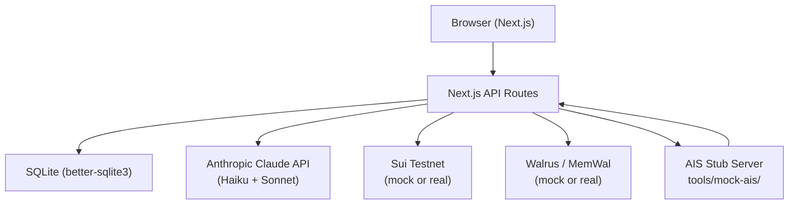

<p align="center">
  
</p>

<p align="center"><strong>AI-powered shipment document passports on the Sui blockchain.</strong></p>

## 🎬 Demo

<p align="center">
  <a href="https://youtu.be/QyDfBLK_Zzw">
    
  </a>
</p>

<p align="center"><a href="https://youtu.be/QyDfBLK_Zzw">▶ Watch the 5-minute demo</a></p>

SuiShip turns a pile of shipping documents (bill of lading, commercial invoice, packing list, certificate of origin) into a verifiable on-chain passport. Claude AI agents extract fields, cross-validate documents, detect trade-finance risk, and produce a tamper-evident record anchored on Sui. Built as a hackathon prototype for the Sui ecosystem.

---

## Why it matters

Trade documents are still the weak link in global commerce: trade-finance fraud costs **~$42B/year**, the trade-finance gap sits at **~$2.5T**, and customs clearance can take **5–7 days**. SuiShip attacks this by turning messy shipment documents into a verifiable, finance-ready passport.

- **Market** — a **~$54B** trade & supply-chain software opportunity, with a **~$9B** serviceable slice for AI + blockchain verification.
- **Revenue** — per-shipment passport fees, SaaS workspaces, memory APIs, risk scans, and verification for banks and customs.
- **Vision** — extend the passport into automated customs clearance, where compliance, payments, and trust move together in real time.

See the full breakdown on the in-app [`/market`](app/market/page.tsx) page.

---

## What works out of the box (mock mode)

No external keys needed beyond `ANTHROPIC_API_KEY`:

| Feature | Description |
|---|---|
| Create shipment | Full form with route, parties, cargo, trade term |
| AI document extraction | Claude Haiku extracts fields from uploaded PDFs |
| AI validation | Cross-validates all documents, produces verdict + explanation |
| Risk agent | Claude Sonnet correlates risk signals from documents and trade history |
| On-chain passport (mock) | SQLite-backed mock Sui client with realistic latency simulation |
| Walrus storage (mock) | `walrus://demo-*` placeholder URIs; full manifest in SQLite |
| Shipment chatbot | Tool-calling chat agent with role-gated access per party |
| Provenance panel | Custody chain of endorsements per party role |
| QR code | Shareable shipment passport link |
| Customs viewer | `/customs` — search by tracking ID |
| Market page | `/market` — commercial thesis, market sizing, and the five-stream revenue model |
| Demo reset | **Refresh** button on `/create` — provisions a fresh MemWal account with seeded company profiles and no document memory, then resets the flow |
| No-wallet minting & signing | Mint passports and sign endorsements without connecting a wallet — the server signs with demo party slush accounts |

---

## Quickstart

```bash
git clone https://github.com/zequann/suiShip.git
cd suiShip
npm install
cp .env.example .env.local
```

Edit `.env.local` — at minimum, set:

```bash
ANTHROPIC_API_KEY=sk-ant-...   # Required — get from console.anthropic.com
```

Then:

```bash
npm run dev
# Open http://localhost:3000
```

Walk the demo: **Landing page (`/`) → Create Shipment (`/create`) → Upload Docs → Run AI Pipeline → Mint Passport → View Passport → Chat**.

---

## What requires external services

| Feature | Service | Required? | Setup |
|---|---|---|---|
| AI extraction & validation | Anthropic API | **Yes** | `ANTHROPIC_API_KEY` in `.env.local` |
| On-chain passport minting | Sui testnet | Optional | Set `SUI_CLIENT=real` + `SUI_NETWORK=testnet` + `SUI_PRIVATE_KEY` |
| AIS vessel monitoring | AIS stub server | Optional | `npm run ais:stub` in a second terminal |
| MemWal document memory | MemWal | Optional | Sign up at memwal.com, set `ENABLE_MEMWAL=true` + keys |
| News-based risk intelligence | SerpAPI | Optional | Free tier at serpapi.com, set `SERPAPI_API_KEY` |
| Real Walrus storage | Walrus devnet | Optional | Set `WALRUS_EPOCHS` and configure Walrus client |

---

## Running the AIS stub (for persistent-agent monitoring)

The persistent-agent feature polls a vessel position server. A minimal stub is included:

```bash
# In a second terminal:
npm run ais:stub
# Starts at http://localhost:8081

# Then in .env.local:
AIS_BASE_URL=http://localhost:8081
```

The stub is a zero-dependency Node.js server (`tools/mock-ais/server.mjs`) that serves realistic vessel position data interpolated between port coordinates. Status page: `http://localhost:8081/mock/ui`.

---

## On-chain mode (Sui testnet)

The Move package is already deployed to Sui testnet:
`0xb64a35301e1703cee52e4712286c5438e8598b2e02290c4c3cc911db78cf33e9`

To use it:

1. Install the [Sui CLI](https://docs.sui.io/guides/developer/getting-started/sui-install)
2. Configure a testnet wallet: `sui client new-address ed25519` and fund via the [Sui faucet](https://faucet.sui.io)
3. Set in `.env.local`:
   ```bash
   SUI_CLIENT=real
   SUI_NETWORK=testnet
   SUI_PRIVATE_KEY=suiprivkey...
   NEXT_PUBLIC_SUISHIP_PACKAGE_ID=0xb64a35301e1703cee52e4712286c5438e8598b2e02290c4c3cc911db78cf33e9
   ```

To redeploy the contract yourself:
```bash
cd move
sui client publish --gas-budget 100000000
# Paste the new package ID into NEXT_PUBLIC_SUISHIP_PACKAGE_ID
```

---

## Architecture



**Agent stack:**
- **Extraction agent** (`src/agent/`) — Claude Haiku, async doc pipeline
- **Validation agent** (`lib/agents/validation-agent.ts`) — cross-document field comparison
- **Risk agent** (`lib/agents/risk-agent.ts`) — trade finance risk correlation
- **Chatbot agent** (`lib/agents/agent-loop.ts`) — tool-calling chat with role gating
- **Persistent agent** (`lib/persistent-agent.ts`) — polls AIS server, emits shipment events
- **Memory agent** (`lib/agents/memory-agent.ts`) — reads/writes MemWal for company context

---

## Demo script (happy path)

> **Tip:** To re-run the walkthrough from a clean slate (e.g. between judges), click **Refresh** at the top of `/create`. It provisions a fresh MemWal account with seeded company profiles and no document memory (takes up to ~2 min).

1. **`/create`** — Fill in shipment details (Exporter: Acme Robotics, Importer: Shanghai Smart Imports, route: LA → Shanghai, cargo: industrial tablets)
2. **Upload documents** — Use the provided demo PDFs or generate with `npm run demo:docs`
3. **Run AI pipeline** — Click "Extract Fields" then "Validate Documents"
4. **Mint passport** — Click "Mint Shipment Passport" (no wallet connect needed — the server signs with demo party slush accounts; mock mode writes to SQLite, real mode writes to Sui)
5. **View passport** — See the on-chain object ID, document hashes, Walrus URIs, QR code
6. **Chatbot** — Switch roles (Exporter / Freight Forwarder / Importer) and ask questions about the shipment
7. **Risk report** — `/risk-memory` shows correlated trade-finance risk signals
8. **(Optional) AIS monitoring** — Start `npm run ais:stub`, trigger a "Freight Forwarder: picked up" endorsement, and watch the persistent agent poll vessel position

---

## Known limitations

- **AIS monitoring** requires a separately running server (`npm run ais:stub`)
- **Real Sui transactions** require testnet SUI for gas
- **MemWal and Walrus** are optional; the app works fully without them in mock mode
- **SEAL integration** (`SEAL_ENABLED=true`) is experimental
- **No production auth** — the demo uses a mock role system; do not deploy as-is
- **Light mode only** — the UI is locked to light mode (`forcedTheme="light"`) for demo consistency
- **Party slush keys** in `data/party-slush-accounts.json` are testnet-only public addresses; generate fresh keys per environment with `npm run slush:setup`

---

## Useful commands

```bash
npm run dev              # Start development server
npm run build            # Production build
npm run typecheck        # TypeScript check
npm run lint             # ESLint
npm run test             # Run tests (Vitest)
npm run ais:stub         # Start the AIS stub server (second terminal)
npm run demo:docs        # Generate demo PDF documents
npm run slush:setup      # Generate party wallet keys (Exporter / Importer / FF)
npm run memwal:setup     # Set up a MemWal account and seed documents
```

---

## Tech stack

| Layer | Technology |
|---|---|
| Framework | Next.js 16, React 19, TypeScript |
| AI | [Anthropic Claude](https://anthropic.com) — Haiku 4.5 (extraction/validation) + Sonnet 4.6 (risk, chat) |
| Blockchain | [Sui](https://sui.io) — Move smart contracts, `@mysten/sui` SDK |
| Storage | [Walrus](https://walrus.site) (blob), [MemWal](https://memwal.com) (structured memory) |
| Database | SQLite via `better-sqlite3` |
| Logging | `pino` |
| Styling | Tailwind CSS |

---

## License

[MIT](LICENSE) — SuiShip Contributors 2026
